# Virtual Lab Experiment 6: Jenkins with Build Tool (Maven)

[](https://github.com/krishnarawatsf/devops-virtual-lab-experiment-6/actions/workflows/ci.yml)
[]()
[]()
[]()
[]()
[]()

---

## 📌 Aim
To implement **Continuous Integration (CI)** using **Jenkins** and **Apache Maven**, where source code is automatically pulled, compiled, multi-tier tested (Smoke, Unit, Integration, Regression), and packaged into an executable artifact whenever changes are pushed to a Git repository.

---

## 🏢 Scenario (Real-Time Use Case)
A software development organization wants to eliminate manual compilation and regression testing errors. Whenever developers push new Java code to GitHub, an automated CI server (Jenkins) should:
1. Detect repository change events.
2. Clone the latest source code.
3. Invoke Apache Maven to resolve dependencies and compile the code.
4. Execute multi-level automated test suites:
   - **Smoke Tests**: Immediate sanity checks verifying runtime health and latency boundaries.
   - **Unit Tests**: Isolating and testing individual business methods.
   - **Integration Tests**: Validating CLI argument streams and stdout output.
   - **Regression & Boundary Tests**: Parameterized datasets ensuring backwards compatibility.
5. Generate an executable JAR file artifact.
6. Report build status and execution outcomes immediately to the engineering team.

---

## 🧪 Testing Pyramid & Test Strategy

| Test Layer | Test Class | Purpose | Execution Command |
| :--- | :--- | :--- | :--- |
| **🔥 Smoke Testing** | `SmokeTest.java` | Fast sanity check (<50ms) verifying JVM bootstrap, memory availability, and constant integrity | `mvn test -Dtest=SmokeTest` |
| **🧩 Unit Testing** | `HelloWorldTest.java` | Isolated validation of greeting logic, fallback handlers, and success rate metric algorithms | `mvn test -Dtest=HelloWorldTest` |
| **🔌 Integration Testing** | `IntegrationTest.java` | End-to-end CLI arguments capture (`--smoke`, `--version`, `--greet`, `--help`) via `System.out` streams | `mvn test -Dtest=IntegrationTest` |
| **🔄 Regression Testing** | `RegressionTest.java` | JUnit 5 `@ParameterizedTest` and `@CsvSource` validating boundary edge cases, usernames, and metrics | `mvn test -Dtest=RegressionTest` |
| **🚀 Full Test Suite** | All Tests (24 Tests) | Complete test suite execution prior to binary packaging | `mvn test` |

---

## 🛠️ Solution Stack

| Requirement | Tool / Technology | Purpose |
| :--- | :--- | :--- |
| **Version Control System** | Git | Distributed source code version management |
| **Remote Repository** | GitHub | Remote cloud Git hosting & Webhook trigger source |
| **CI/CD Automation Server**| Jenkins | Continuous Integration server orchestrating pipelines |
| **Build Automation Tool** | Apache Maven | Project lifecycle management, compilation & packaging |
| **Programming Language** | Java (OpenJDK 11/17) | Core application code runtime |
| **Testing Framework** | JUnit 5 (Jupiter & Params) | Automated multi-tier testing & regression verification |
| **Target OS Environment** | Linux / Ubuntu / macOS | Host server execution environment |

---

## 🏗️ Architecture & Workflow Overview

```mermaid
flowchart LR
    subgraph Developer["👨‍💻 Developer"]
        A[Write Java Code & Tests] --> B[git commit & push]
    end

    subgraph GitHub["🐙 GitHub"]
        B --> C[Remote Repository]
        C -- "GitHub Webhook / SCM Polling" --> D[Jenkins Automation Server]
    end

    subgraph Jenkins["⚙️ Jenkins CI Server"]
        D --> E[Checkout Source Code]
        E --> F[mvn compile]
        F --> G["🔥 Smoke Tests<br/>(Health & Latency)"]
        G --> H["🧩 Unit Tests<br/>(Business Logic)"]
        H --> I["🔌 Integration Tests<br/>(CLI & Streams)"]
        I --> J["🔄 Regression Tests<br/>(Parameterized Bounds)"]
        J --> K[mvn package]
        K --> L[Archive JAR Artifact]
    end

    subgraph Status["📊 Output Status"]
        L --> M["✅ BUILD SUCCESS<br/>(24 Tests Passed)"]
    end
```



---

## 📂 Project Directory Structure

```text
jenkins-lab/
├── .github/
│   └── workflows/
│       └── ci.yml             # GitHub Actions CI workflow (Smoke, Unit, Int, Reg)
├── src/
│   └── HelloWorld.java        # Core Java Application Class with CLI & Health API
├── test/
│   ├── SmokeTest.java         # Smoke & Sanity Tests (Latency, Health, Memory)
│   ├── HelloWorldTest.java    # Unit Tests (Core Logic, Metric Calculations)
│   ├── IntegrationTest.java   # Integration Tests (CLI Arguments, Stream Capture)
│   └── RegressionTest.java    # Parameterized Regression & Boundary Tests
├── Jenkinsfile                # Declarative Jenkins CI/CD Pipeline (Multi-Stage)
├── pom.xml                    # Maven POM Configuration (JUnit 5 + Surefire)
├── .gitignore                 # Git ignore rules for build artifacts
└── README.md                  # Comprehensive Lab Documentation & Viva Voce
```

---

## 📝 Source Code Files

### 1. `src/HelloWorld.java`
```java
public class HelloWorld {

    public static final String APP_NAME = "Jenkins Maven CI Application";
    public static final String APP_VERSION = "1.0.0";
    public static final String DEFAULT_MESSAGE = "Hello from Jenkins CI Pipeline!";

    public static void main(String[] args) {
        if (args != null && args.length > 0) {
            String command = args[0].trim();
            switch (command) {
                case "--smoke":
                case "-s":
                    System.out.println("SMOKE_TEST_OK: " + getHealthStatus());
                    break;
                case "--version":
                case "-v":
                    System.out.println(APP_NAME + " version " + APP_VERSION);
                    break;
                case "--greet":
                    String target = (args.length > 1) ? args[1] : "DevOps Engineer";
                    System.out.println(getCustomMessage(target));
                    break;
                case "--help":
                case "-h":
                    printHelp();
                    break;
                default:
                    System.out.println(getCustomMessage(command));
                    break;
            }
        } else {
            System.out.println(getMessage());
        }
    }

    public static String getMessage() {
        return DEFAULT_MESSAGE;
    }

    public static String getCustomMessage(String name) {
        if (name == null || name.trim().isEmpty()) {
            return DEFAULT_MESSAGE;
        }
        return "Hello " + name.trim() + " from Jenkins CI Pipeline!";
    }

    public static String getHealthStatus() {
        long freeMem = Runtime.getRuntime().freeMemory();
        long maxMem = Runtime.getRuntime().maxMemory();
        return "HEALTHY [FreeMemory: " + (freeMem / (1024 * 1024)) + "MB / MaxMemory: " + (maxMem / (1024 * 1024)) + "MB]";
    }

    public static boolean isHealthy() {
        return Runtime.getRuntime().availableProcessors() > 0 && Runtime.getRuntime().freeMemory() > 0;
    }

    public static double calculateSuccessRate(int totalTests, int passedTests) {
        if (totalTests <= 0) {
            return 0.0;
        }
        if (passedTests < 0 || passedTests > totalTests) {
            throw new IllegalArgumentException("Passed tests must be between 0 and totalTests");
        }
        return (double) passedTests / totalTests * 100.0;
    }

    public static String getEnvironmentInfo() {
        return "Java " + System.getProperty("java.version") + " (" + System.getProperty("os.name") + ")";
    }

    private static void printHelp() {
        System.out.println("Usage: java -jar jenkins-lab.jar [OPTIONS]");
        System.out.println("Options:");
        System.out.println("  --smoke, -s       Execute quick smoke health check");
        System.out.println("  --version, -v     Display application version");
        System.out.println("  --greet <name>    Print custom greeting message");
        System.out.println("  --help, -h        Show this help manual");
    }
}
```

---

### 2. `test/SmokeTest.java`
```java
import org.junit.jupiter.api.DisplayName;
import org.junit.jupiter.api.Tag;
import org.junit.jupiter.api.Test;
import java.time.Duration;

import static org.junit.jupiter.api.Assertions.*;

@Tag("smoke")
@DisplayName("Smoke Tests - Critical Path & Runtime Health Verification")
public class SmokeTest {

    @Test
    @DisplayName("Smoke 01: Application class loads and constants are non-null")
    void testApplicationClassPresence() {
        assertNotNull(HelloWorld.APP_NAME, "App name must be defined");
        assertNotNull(HelloWorld.APP_VERSION, "App version must be defined");
        assertNotNull(HelloWorld.DEFAULT_MESSAGE, "Default message must be defined");
        assertTrue(HelloWorld.APP_VERSION.matches("\\d+\\.\\d+\\.\\d+"), "Version should follow semver");
    }

    @Test
    @DisplayName("Smoke 02: JVM environment and runtime health check")
    void testRuntimeHealthCheck() {
        assertTrue(HelloWorld.isHealthy(), "Runtime health check should return true");
        String healthStatus = HelloWorld.getHealthStatus();
        assertNotNull(healthStatus);
        assertTrue(healthStatus.startsWith("HEALTHY"), "Health status string should begin with HEALTHY");
    }

    @Test
    @DisplayName("Smoke 03: Fast execution response time (Latency < 50ms)")
    void testCoreResponseExecutionSpeed() {
        assertTimeoutPreemptively(Duration.ofMillis(50), () -> {
            String msg = HelloWorld.getMessage();
            assertNotNull(msg);
            assertEquals("Hello from Jenkins CI Pipeline!", msg);
        }, "Smoke execution must complete within 50 milliseconds");
    }

    @Test
    @DisplayName("Smoke 04: Environment metadata availability")
    void testEnvironmentInfo() {
        String env = HelloWorld.getEnvironmentInfo();
        assertNotNull(env);
        assertTrue(env.contains("Java"), "Environment info must include Java runtime version");
    }
}
```

---

### 3. `test/IntegrationTest.java`
```java
import org.junit.jupiter.api.AfterEach;
import org.junit.jupiter.api.BeforeEach;
import org.junit.jupiter.api.DisplayName;
import org.junit.jupiter.api.Tag;
import org.junit.jupiter.api.Test;

import java.io.ByteArrayOutputStream;
import java.io.PrintStream;

import static org.junit.jupiter.api.Assertions.*;

@Tag("integration")
@DisplayName("Integration Tests - CLI Flow & Subsystem Integration")
public class IntegrationTest {

    private final ByteArrayOutputStream outContent = new ByteArrayOutputStream();
    private final PrintStream originalOut = System.out;

    @BeforeEach
    void setUpStreams() {
        System.setOut(new PrintStream(outContent));
    }

    @AfterEach
    void restoreStreams() {
        System.setOut(originalOut);
    }

    @Test
    @DisplayName("CLI Integration: Test --smoke argument")
    void testCliSmokeArgument() {
        HelloWorld.main(new String[]{"--smoke"});
        String output = outContent.toString().trim();
        assertTrue(output.contains("SMOKE_TEST_OK"));
        assertTrue(output.contains("HEALTHY"));
    }

    @Test
    @DisplayName("CLI Integration: Test --version argument")
    void testCliVersionArgument() {
        HelloWorld.main(new String[]{"--version"});
        String output = outContent.toString().trim();
        assertTrue(output.contains(HelloWorld.APP_NAME));
        assertTrue(output.contains(HelloWorld.APP_VERSION));
    }

    @Test
    @DisplayName("CLI Integration: Test --greet argument with name")
    void testCliGreetArgument() {
        HelloWorld.main(new String[]{"--greet", "Jenkins"});
        String output = outContent.toString().trim();
        assertEquals("Hello Jenkins from Jenkins CI Pipeline!", output);
    }

    @Test
    @DisplayName("CLI Integration: Test --help argument")
    void testCliHelpArgument() {
        HelloWorld.main(new String[]{"--help"});
        String output = outContent.toString().trim();
        assertTrue(output.contains("Usage:"));
        assertTrue(output.contains("--smoke"));
    }

    @Test
    @DisplayName("CLI Integration: Test default execution without arguments")
    void testCliDefaultExecution() {
        HelloWorld.main(new String[]{});
        String output = outContent.toString().trim();
        assertEquals("Hello from Jenkins CI Pipeline!", output);
    }
}
```

---

### 4. `test/RegressionTest.java`
```java
import org.junit.jupiter.api.DisplayName;
import org.junit.jupiter.api.Tag;
import org.junit.jupiter.api.Test;
import org.junit.jupiter.params.ParameterizedTest;
import org.junit.jupiter.params.provider.CsvSource;
import org.junit.jupiter.params.provider.ValueSource;

import static org.junit.jupiter.api.Assertions.*;

@Tag("regression")
@DisplayName("Regression & Boundary Tests")
public class RegressionTest {

    @ParameterizedTest(name = "Test greeting for user: {0}")
    @ValueSource(strings = {"Alice", "Bob", "DevOps-Lead", "CI_Bot_99", "12345"})
    @DisplayName("Regression: Parameterized greeting test with varied input types")
    void testParameterizedGreetings(String username) {
        String greeting = HelloWorld.getCustomMessage(username);
        assertTrue(greeting.contains(username));
        assertTrue(greeting.endsWith("from Jenkins CI Pipeline!"));
    }

    @ParameterizedTest(name = "Total: {0}, Passed: {1} -> Expected: {2}%")
    @CsvSource({
        "100, 100, 100.0",
        "100, 50, 50.0",
        "4, 3, 75.0",
        "3, 1, 33.333333333333336"
    })
    @DisplayName("Regression: Success rate calculations for varied datasets")
    void testParameterizedSuccessRate(int total, int passed, double expected) {
        assertEquals(expected, HelloWorld.calculateSuccessRate(total, passed), 0.0001);
    }

    @Test
    @DisplayName("Boundary: Special Unicode characters handling")
    void testSpecialCharactersGreeting() {
        String specialInput = "⚡ DevSecOps 🚀";
        String result = HelloWorld.getCustomMessage(specialInput);
        assertEquals("Hello ⚡ DevSecOps 🚀 from Jenkins CI Pipeline!", result);
    }
}
```

---

### 5. `Jenkinsfile`
```groovy
pipeline {
    agent any

    tools {
        maven 'Maven-3.9'
        jdk 'Java-11'
    }

    options {
        buildDiscarder(logRotator(numToKeepStr: '10'))
        timestamps()
    }

    stages {
        stage('Checkout') {
            steps {
                echo 'Checking out source code from GitHub repository...'
                checkout scm
            }
        }

        stage('Compile') {
            steps {
                echo 'Compiling Java Source Code with Maven...'
                sh 'mvn compile'
            }
        }

        stage('Smoke Tests') {
            steps {
                echo '========================================='
                echo ' RUNNING SMOKE TESTS (HEALTH & LATENCY)  '
                echo '========================================='
                sh 'mvn test -Dtest=SmokeTest'
            }
        }

        stage('Unit Tests') {
            steps {
                echo '========================================='
                echo '       RUNNING CORE UNIT TESTS           '
                echo '========================================='
                sh 'mvn test -Dtest=HelloWorldTest'
            }
        }

        stage('Integration & CLI Tests') {
            steps {
                echo '========================================='
                echo ' RUNNING INTEGRATION & CLI STREAM TESTS  '
                echo '========================================='
                sh 'mvn test -Dtest=IntegrationTest'
            }
        }

        stage('Regression & Boundary Tests') {
            steps {
                echo '========================================='
                echo ' RUNNING PARAMETERIZED REGRESSION TESTS  '
                echo '========================================='
                sh 'mvn test -Dtest=RegressionTest'
            }
            post {
                always {
                    junit allowEmptyResults: true, testResults: 'target/surefire-reports/*.xml'
                }
            }
        }

        stage('Package & Build Artifact') {
            steps {
                echo 'Packaging application into executable JAR...'
                sh 'mvn package -DskipTests'
            }
        }

        stage('Runtime Verification') {
            steps {
                echo 'Verifying application runtime execution and CLI smoke check...'
                sh 'java -jar target/jenkins-lab-1.0-SNAPSHOT.jar'
                sh 'java -jar target/jenkins-lab-1.0-SNAPSHOT.jar --smoke'
                sh 'java -jar target/jenkins-lab-1.0-SNAPSHOT.jar --version'
                sh 'java -jar target/jenkins-lab-1.0-SNAPSHOT.jar --greet "Jenkins CI"'
            }
        }

        stage('Archive Artifacts') {
            steps {
                echo 'Archiving build artifacts...'
                archiveArtifacts artifacts: 'target/*.jar', fingerprint: true, allowEmptyArchive: false
            }
        }
    }

    post {
        success {
            echo '==================================================='
            echo '  ALL TEST SUITES (SMOKE, UNIT, INT, REG) PASSED!  '
            echo '  JENKINS CI PIPELINE COMPLETED SUCCESSFULLY       '
            echo '==================================================='
        }
        failure {
            echo '==================================================='
            echo '        JENKINS CI PIPELINE BUILD/TEST FAILED       '
            echo '==================================================='
        }
    }
}
```

---

## 🚀 Step-by-Step Implementation Guide

### PART A – Install Required Tools (Ubuntu/Linux Server)

#### Step 1: Install OpenJDK
```bash
sudo apt update
sudo apt install openjdk-11-jdk -y
java -version
```

#### Step 2: Install Apache Maven
```bash
sudo apt install maven -y
mvn -version
```

#### Step 3: Install and Start Jenkins
```bash
curl -fsSL https://pkg.jenkins.io/debian-stable/jenkins.io-2023.key | sudo tee \
  /usr/share/keyrings/jenkins-keyring.asc > /dev/null
echo deb [signed-by=/usr/share/keyrings/jenkins-keyring.asc] \
  https://pkg.jenkins.io/debian-stable binary/ | sudo tee \
  /etc/apt/sources.list.d/jenkins.list > /dev/null

sudo apt update
sudo apt install jenkins -y

sudo systemctl start jenkins
sudo systemctl enable jenkins
sudo systemctl status jenkins
```

#### Step 4: Access and Unlock Jenkins
1. Open browser: `http://localhost:8080` (or `http://<SERVER_IP>:8080`).
2. Retrieve initial admin password:
   ```bash
   sudo cat /var/lib/jenkins/secrets/initialAdminPassword
   ```
3. Click **"Install suggested plugins"** and complete admin setup.

---

### PART B – Testing Commands

```bash
# 1. Execute Smoke Tests only (Sanity check)
mvn test -Dtest=SmokeTest

# 2. Execute Unit Tests only
mvn test -Dtest=HelloWorldTest

# 3. Execute Integration Tests only
mvn test -Dtest=IntegrationTest

# 4. Execute Regression Tests only
mvn test -Dtest=RegressionTest

# 5. Execute Complete Test Suite (All 24 Tests)
mvn clean test

# 6. Build & Package Executable JAR
mvn clean package

# 7. Test Executable JAR with Smoke Flags
java -jar target/jenkins-lab-1.0-SNAPSHOT.jar --smoke
java -jar target/jenkins-lab-1.0-SNAPSHOT.jar --greet "DevOps Team"
```

---

## 🎯 Test Execution Logs (Console Output)

```text
[INFO] -------------------------------------------------------
[INFO]  T E S T S
[INFO] -------------------------------------------------------
[INFO] Running SmokeTest
[INFO] Tests run: 4, Failures: 0, Errors: 0, Skipped: 0, Time elapsed: 0.025 s -- in SmokeTest
[INFO] Running RegressionTest
[INFO] Tests run: 10, Failures: 0, Errors: 0, Skipped: 0, Time elapsed: 0.036 s -- in RegressionTest
[INFO] Running HelloWorldTest
Hello from Jenkins CI Pipeline!
[INFO] Tests run: 5, Failures: 0, Errors: 0, Skipped: 0, Time elapsed: 0.004 s -- in HelloWorldTest
[INFO] Running IntegrationTest
[INFO] Tests run: 5, Failures: 0, Errors: 0, Skipped: 0, Time elapsed: 0.004 s -- in IntegrationTest
[INFO] 
[INFO] Results:
[INFO] 
[INFO] Tests run: 24, Failures: 0, Errors: 0, Skipped: 0
[INFO] 
[INFO] ------------------------------------------------------------------------
[INFO] BUILD SUCCESS
[INFO] ------------------------------------------------------------------------
```

---

## 📚 Viva Voce Questions & Answers (Testing & CI Focus)

### 🟢 Basic Level

#### Q1: What is a Smoke Test?
> **Answer:** A Smoke Test (also known as Build Verification Testing or Sanity Check) is a quick, initial test performed on a new build to ensure that critical features work and the application is stable enough for deeper testing. If a smoke test fails, the build is immediately rejected.

#### Q2: What is a Unit Test?
> **Answer:** A Unit Test is an automated test that validates individual units or components of software (e.g., functions, methods, classes) in isolation from external dependencies.

#### Q3: What is Continuous Integration (CI)?
> **Answer:** CI is the DevOps practice where developers frequently commit code to a shared repository, triggering automated builds, smoke tests, and regression test suites to detect defects early.

---

### 🟡 Intermediate Level

#### Q4: What is the difference between Smoke Testing, Sanity Testing, and Regression Testing?
> **Answer:**
> - **Smoke Testing**: Wide and shallow test suite verifying that critical basic functions work (e.g., app starts, memory healthy, responds in <50ms). Done on every new build.
> - **Sanity Testing**: Narrow and deep test suite verifying specific bug fixes or features without testing the entire application.
> - **Regression Testing**: Comprehensive test suite ensuring that recent code changes have not broken existing, working features.

#### Q5: What is Integration Testing in a CI Pipeline?
> **Answer:** Integration testing verifies that individual modules, services, external interfaces (like CLI arguments, databases, APIs) work together as expected.

#### Q6: What is Parameterized Testing in JUnit 5?
> **Answer:** Parameterized testing allows a single test method to run multiple times with different arguments using annotations like `@ValueSource`, `@CsvSource`, or `@MethodSource`.

---

### 🔴 Advanced Level

#### Q7: Why are Smoke Tests executed before Unit and Regression Tests in a CI/CD Pipeline?
> **Answer:** "Fail-Fast Principle": Smoke tests take milliseconds to execute. If the core JVM runtime or critical configuration is broken, running long unit or integration suites wastes compute resources and time. Smoke tests fail the pipeline instantly.

#### Q8: How does Jenkins handle test reports from Maven?
> **Answer:** Maven's `maven-surefire-plugin` generates standard XML test report files in `target/surefire-reports/*.xml`. Jenkins reads these reports using the `junit` post-action step (`junit 'target/surefire-reports/*.xml'`) and plots visual test result trends, failure breakdowns, and pass/fail metrics on the project dashboard.

---

## 👨‍💻 Author
- **Name:** Krishna Rawat
- **GitHub:** [@krishnarawatsf](https://github.com/krishnarawatsf)
- **Course:** Cloud Computing & DevOps Virtual Labs (AWS 6 / VLE 6)
