# Virtual Lab Experiment 6: Jenkins with Build Tool (Maven)

[](https://github.com/krishnarawatsf/devops-virtual-lab-experiment-6/actions/workflows/ci.yml)
[]()
[]()
[]()
[]()

---

## 📌 Aim
To implement **Continuous Integration (CI)** using **Jenkins** and **Apache Maven**, where source code is automatically pulled, compiled, tested, and packaged into an executable artifact whenever changes are pushed to a Git repository.

---

## 🏢 Scenario (Real-Time Use Case)
A software development organization wants to eliminate manual compilation and regression testing errors. Whenever developers push new Java code to GitHub, an automated CI server (Jenkins) should:
1. Detect repository change events.
2. Clone the latest source code.
3. Invoke Apache Maven to resolve dependencies and compile the code.
4. Execute unit test suites.
5. Generate an executable JAR file artifact.
6. Report build status and execution outcomes immediately to the engineering team.

---

## 🛠️ Solution Stack

| Requirement | Tool / Technology | Purpose |
| :--- | :--- | :--- |
| **Version Control System** | Git | Distributed source code version management |
| **Remote Repository** | GitHub | Remote cloud Git hosting & Webhook trigger source |
| **CI/CD Automation Server**| Jenkins | Continuous Integration server orchestrating pipelines |
| **Build Automation Tool** | Apache Maven | Project lifecycle management, compilation & packaging |
| **Programming Language** | Java (OpenJDK 11/17) | Core application code runtime |
| **Testing Framework** | JUnit 5 | Automated unit testing & regression verification |
| **Target OS Environment** | Linux / Ubuntu / macOS | Host server execution environment |

---

## 🏗️ Architecture & Workflow Overview

```mermaid
flowchart LR
    subgraph Developer["👨‍💻 Developer"]
        A[Write Java Code] --> B[git commit & push]
    end

    subgraph GitHub["🐙 GitHub"]
        B --> C[Remote Repository]
        C -- "GitHub Webhook / SCM Polling" --> D[Jenkins Automation Server]
    end

    subgraph Jenkins["⚙️ Jenkins CI Server"]
        D --> E[Checkout Source Code]
        E --> F[Invoke Maven Targets]
        F --> G[mvn compile]
        G --> H[mvn test]
        H --> I[mvn package]
        I --> J[Archive JAR Artifact]
    end

    subgraph Status["📊 Output Status"]
        J --> K["✅ BUILD SUCCESS<br/>(Artifact: jenkins-lab.jar)"]
    end
```



---

## 📂 Project Directory Structure

```text
jenkins-lab/
├── .github/
│   └── workflows/
│       └── ci.yml             # GitHub Actions CI workflow
├── src/
│   └── HelloWorld.java        # Core Java Application Class
├── test/
│   └── HelloWorldTest.java    # JUnit 5 Unit Tests
├── Jenkinsfile                # Declarative Jenkins CI/CD Pipeline
├── pom.xml                    # Maven Project Object Model Configuration
├── .gitignore                 # Git ignore rules for build artifacts
└── README.md                  # Comprehensive Lab Documentation & Viva Voce
```

---

## 📝 Source Code Files

### 1. `src/HelloWorld.java`
```java
public class HelloWorld {
    public static void main(String[] args) {
        System.out.println(getMessage());
    }

    public static String getMessage() {
        return "Hello from Jenkins CI Pipeline!";
    }
}
```

### 2. `test/HelloWorldTest.java`
```java
import org.junit.jupiter.api.Test;
import static org.junit.jupiter.api.Assertions.assertEquals;
import static org.junit.jupiter.api.Assertions.assertNotNull;

public class HelloWorldTest {

    @Test
    void testGetMessage() {
        String expected = "Hello from Jenkins CI Pipeline!";
        assertEquals(expected, HelloWorld.getMessage(), "Message should match the expected CI greeting.");
    }

    @Test
    void testMainMethod() {
        HelloWorld.main(new String[]{});
        assertNotNull(HelloWorld.getMessage());
    }
}
```

### 3. `pom.xml`
```xml
<project xmlns="http://maven.apache.org/POM/4.0.0"
         xmlns:xsi="http://www.w3.org/2001/XMLSchema-instance"
         xsi:schemaLocation="http://maven.apache.org/POM/4.0.0 http://maven.apache.org/xsd/maven-4.0.0.xsd">
    <modelVersion>4.0.0</modelVersion>

    <groupId>com.devops</groupId>
    <artifactId>jenkins-lab</artifactId>
    <version>1.0-SNAPSHOT</version>
    <packaging>jar</packaging>

    <name>jenkins-lab</name>
    <description>Virtual Lab Experiment-6: Continuous Integration with Jenkins and Maven</description>

    <properties>
        <maven.compiler.source>11</maven.compiler.source>
        <maven.compiler.target>11</maven.compiler.target>
        <maven.compiler.release>11</maven.compiler.release>
        <project.build.sourceEncoding>UTF-8</project.build.sourceEncoding>
        <junit.version>5.10.2</junit.version>
    </properties>

    <dependencies>
        <dependency>
            <groupId>org.junit.jupiter</groupId>
            <artifactId>junit-jupiter-api</artifactId>
            <version>${junit.version}</version>
            <scope>test</scope>
        </dependency>
        <dependency>
            <groupId>org.junit.jupiter</groupId>
            <artifactId>junit-jupiter-engine</artifactId>
            <version>${junit.version}</version>
            <scope>test</scope>
        </dependency>
    </dependencies>

    <build>
        <sourceDirectory>src</sourceDirectory>
        <testSourceDirectory>test</testSourceDirectory>
        <plugins>
            <plugin>
                <groupId>org.apache.maven.plugins</groupId>
                <artifactId>maven-compiler-plugin</artifactId>
                <version>3.13.0</version>
                <configuration>
                    <release>11</release>
                </configuration>
            </plugin>
            <plugin>
                <groupId>org.apache.maven.plugins</groupId>
                <artifactId>maven-surefire-plugin</artifactId>
                <version>3.2.5</version>
            </plugin>
            <plugin>
                <groupId>org.apache.maven.plugins</groupId>
                <artifactId>maven-jar-plugin</artifactId>
                <version>3.4.1</version>
                <configuration>
                    <archive>
                        <manifest>
                            <mainClass>HelloWorld</mainClass>
                        </manifest>
                    </archive>
                </configuration>
            </plugin>
        </plugins>
    </build>
</project>
```

---

## 🚀 Step-by-Step Implementation Guide

### PART A – Install Required Tools (Ubuntu/Linux Server)

#### Step 1: Install OpenJDK
```bash
sudo apt update
sudo apt install openjdk-11-jdk -y
java -version
```

#### Step 2: Install Apache Maven
```bash
sudo apt install maven -y
mvn -version
```

#### Step 3: Install and Start Jenkins
```bash
# Add Jenkins repository key and source list
curl -fsSL https://pkg.jenkins.io/debian-stable/jenkins.io-2023.key | sudo tee \
  /usr/share/keyrings/jenkins-keyring.asc > /dev/null
echo deb [signed-by=/usr/share/keyrings/jenkins-keyring.asc] \
  https://pkg.jenkins.io/debian-stable binary/ | sudo tee \
  /etc/apt/sources.list.d/jenkins.list > /dev/null

sudo apt update
sudo apt install jenkins -y

# Start Jenkins daemon
sudo systemctl start jenkins
sudo systemctl enable jenkins
sudo systemctl status jenkins
```

#### Step 4: Access and Unlock Jenkins
1. Open browser: `http://localhost:8080` (or `http://<SERVER_IP>:8080`).
2. Retrieve initial admin password:
   ```bash
   sudo cat /var/lib/jenkins/secrets/initialAdminPassword
   ```
3. Click **"Install suggested plugins"** and create your Jenkins administrator account.

---

### PART B – Create Sample Java Application & Maven Build Locally

```bash
# Test build locally
mvn clean test
mvn clean package

# Run generated JAR
java -jar target/jenkins-lab-1.0-SNAPSHOT.jar
```

---

### PART C – Push Code to GitHub

```bash
git init
git add .
git commit -m "feat: implement Jenkins and Maven CI project for Experiment 6"
git branch -M main
git remote add origin https://github.com/krishnarawatsf/devops-virtual-lab-experiment-6.git
git push -u origin main
```

---

### PART D – Configure Jenkins Freestyle Job

1. Open Jenkins Dashboard (`http://localhost:8080`).
2. Click **New Item** ➡️ Enter Name `jenkins-maven-freestyle-lab` ➡️ Select **Freestyle project** ➡️ Click **OK**.
3. **Source Code Management (SCM)**:
   - Select **Git**.
   - Repository URL: `https://github.com/krishnarawatsf/devops-virtual-lab-experiment-6.git`
   - Branch Specifier: `*/main`
4. **Build Triggers**:
   - Check **GitHub hook trigger for GITScm polling** OR **Poll SCM** (`H/5 * * * *`).
5. **Build Steps**:
   - Click **Add build step** ➡️ Select **Invoke top-level Maven targets**.
   - Maven Version: Select configured Maven.
   - Goals: `clean test package`
6. **Post-build Actions**:
   - Select **Archive the artifacts** ➡️ Files to archive: `target/*.jar`
   - Select **Publish JUnit test result report** ➡️ Test report XMLs: `target/surefire-reports/*.xml`
7. Click **Save**.

---

### PART E – Configure Jenkins Pipeline Job (Using Jenkinsfile)

1. Open Jenkins Dashboard ➡️ Click **New Item**.
2. Enter Name `jenkins-maven-pipeline-lab` ➡️ Select **Pipeline** ➡️ Click **OK**.
3. Scroll down to **Pipeline Definition**:
   - Definition: **Pipeline script from SCM**
   - SCM: **Git**
   - Repository URL: `https://github.com/krishnarawatsf/devops-virtual-lab-experiment-6.git`
   - Branch Specifier: `*/main`
   - Script Path: `Jenkinsfile`
4. Click **Save**.

---

### PART F – Execute Build & Verify Output

1. Click **Build Now** on the left menu.
2. Navigate to Build `#1` ➡️ Click **Console Output**.
3. Verify expected execution output:

```text
Started by user admin
Obtained Jenkinsfile from git https://github.com/krishnarawatsf/devops-virtual-lab-experiment-6.git
[Pipeline] Start of Pipeline
[Pipeline] node
Running on Jenkins in /var/lib/jenkins/workspace/jenkins-maven-pipeline-lab
[Pipeline] {
[Pipeline] stage (Checkout)
[Pipeline] checkout
 > git clone https://github.com/krishnarawatsf/devops-virtual-lab-experiment-6.git
[Pipeline] stage (Compile)
[Pipeline] sh
+ mvn compile
[INFO] Scanning for projects...
[INFO] Compiling 1 source file with javac to target/classes
[INFO] BUILD SUCCESS
[Pipeline] stage (Unit Testing)
[Pipeline] sh
+ mvn test
[INFO] Running HelloWorldTest
Hello from Jenkins CI Pipeline!
[INFO] Tests run: 2, Failures: 0, Errors: 0, Skipped: 0
[INFO] BUILD SUCCESS
[Pipeline] stage (Package & Build Artifact)
[Pipeline] sh
+ mvn clean package
[INFO] Building jar: target/jenkins-lab-1.0-SNAPSHOT.jar
[INFO] BUILD SUCCESS
[Pipeline] stage (Execute & Verify)
[Pipeline] sh
+ java -jar target/jenkins-lab-1.0-SNAPSHOT.jar
Hello from Jenkins CI Pipeline!
[Pipeline] stage (Archive Artifacts)
[Pipeline] archiveArtifacts
Archiving artifacts: target/jenkins-lab-1.0-SNAPSHOT.jar
[Pipeline] }
[Pipeline] // End of Pipeline
===================================================
  JENKINS CI PIPELINE COMPLETED SUCCESSFULLY (PASSED) 
===================================================
Finished: SUCCESS
```

---

## 🎯 Observations
1. **Automated SCM Integration**: Jenkins accurately detected changes pushed to the GitHub repository and pulled the source code.
2. **Automated Lifecycle Management**: Maven resolved dependencies, compiled code, executed JUnit tests, and packaged the binary without manual intervention.
3. **Artifact Retention**: The generated JAR artifact was cleanly built and archived on Jenkins.
4. **Early Bug Detection**: Automated testing ensured code correctness before artifact generation.

---

## 🏆 Result
The Continuous Integration (CI) pipeline was successfully implemented using **Jenkins** and **Apache Maven**. The pipeline continuously builds, tests, and packages the Java application whenever updates are pushed to the GitHub repository.

---

## 📚 Viva Voce Questions & Answers

### 🟢 Basic Level

#### Q1: What is Jenkins?
> **Answer:** Jenkins is an open-source automation server written in Java. It enables developers to reliably build, test, and deploy their software continuously (CI/CD) through automated pipelines and hundreds of community plugins.

#### Q2: What is Continuous Integration (CI)?
> **Answer:** Continuous Integration (CI) is a DevOps software development practice where developers merge their code changes into a central repository frequently. Each integration is verified by an automated build and test suite to detect integration bugs early.

#### Q3: What is Apache Maven?
> **Answer:** Apache Maven is a project management and comprehension tool based on the concept of a Project Object Model (POM). Maven manages project builds, reporting, dependency resolution, and documentation from a central piece of information.

#### Q4: What is a Build Tool?
> **Answer:** A build tool is a program that automates the creation of executable applications from source code. It handles tasks such as compiling code, linking libraries, running automated tests, downloading dependencies, and packaging binaries into formats like JAR, WAR, or ZIP.

#### Q5: What is `pom.xml`?
> **Answer:** `pom.xml` (Project Object Model XML) is the fundamental unit of configuration in Maven. It contains project configuration information, dependencies, plugins, build profiles, and metadata required by Maven to build the project.

---

### 🟡 Intermediate Level

#### Q6: What is the difference between Continuous Integration (CI) and Continuous Deployment (CD)?
> **Answer:** 
> - **Continuous Integration (CI)** focuses on automatically building and testing code every time a commit is pushed to find integration issues early.
> - **Continuous Delivery (CD)** ensures validated code changes are automatically prepared and staged for release to production.
> - **Continuous Deployment (CD)** automatically releases validated builds directly to end-user production environments without manual approval.

#### Q7: What are Jenkins Plugins?
> **Answer:** Jenkins plugins are modular extensions that enhance Jenkins functionality. They allow Jenkins to integrate with various tools and platforms, such as Git, GitHub, Maven, Docker, Kubernetes, Slack, and AWS.

#### Q8: What is a Jenkins Pipeline?
> **Answer:** A Jenkins Pipeline is a suite of plugins supporting the implementation and integration of continuous delivery pipelines into Jenkins. It defines the entire build/test/deploy lifecycle through code (`Jenkinsfile`) as Declarative or Scripted pipelines ("Pipeline as Code").

#### Q9: What is a Workspace in Jenkins?
> **Answer:** A workspace is a designated directory on the Jenkins server (or build agent) file system where Jenkins checks out source code from SCM and runs build/test scripts for a specific job.

#### Q10: What is the difference between a Freestyle Project and a Pipeline Project in Jenkins?
> **Answer:**
> - **Freestyle Project**: Configured via the Jenkins GUI form fields. It is simple to set up for basic tasks but lacks version control, complex branching logic, and portability.
> - **Pipeline Project**: Written as code (`Jenkinsfile`) stored directly in the Git repository. It supports complex workflows, stage visualization, error handling, parallel execution, and versioning alongside application code.

---

### 🔴 Advanced Level

#### Q11: How does Jenkins trigger builds automatically upon Git push?
> **Answer:** Jenkins can trigger builds automatically via:
> 1. **Webhooks (Push-based - Recommended)**: GitHub sends an HTTP POST payload to the Jenkins endpoint (`http://<jenkins-url>/github-webhook/`) instantly when a commit is pushed.
> 2. **Polling SCM (Pull-based)**: Jenkins periodically queries the Git repository on a cron schedule (e.g., `H/5 * * * *`) to check if new commits exist.
> 3. **Generic Webhook Trigger Plugin**: Triggers builds based on custom HTTP API requests.

#### Q12: What is a Webhook in Jenkins and how does it work?
> **Answer:** A Webhook is an HTTP callback triggered by an event in an external service (like GitHub). When a developer pushes code, GitHub makes a POST request to Jenkins. Jenkins intercepts the payload, matches the repository and branch, and initiates the corresponding pipeline immediately with zero polling delay.

#### Q13: How does Maven manage dependencies and resolve transitive dependencies?
> **Answer:** Maven manages dependencies through its coordinate system (`groupId`, `artifactId`, `version`). When building, Maven searches the local repository (`~/.m2/repository`), then configured mirrors or Maven Central. Maven uses dependency mediation (nearest-definition wins) to resolve transitive dependencies and allows exclusions or version enforcement via `<dependencyManagement>`.

#### Q14: What is Artifact Generation in Maven and where are artifacts stored?
> **Answer:** Artifact generation is the packaging phase (`mvn package`) where compiled classes and resources are bundled into a distributable archive (e.g., `.jar`, `.war`). Artifacts are stored locally in the `target/` folder, cached in the local repository (`~/.m2`), or deployed to remote binary managers (Nexus, Artifactory, AWS CodeArtifact) using `mvn deploy`.

#### Q15: Explain the key stages of a standard Jenkins CI/CD Pipeline.
> **Answer:**
> 1. **Checkout / SCM**: Pulls latest source code and tags from Git.
> 2. **Build / Compile**: Invokes compiler (`mvn compile`) to validate syntax and produce bytecode.
> 3. **Unit Test**: Runs unit tests (`mvn test`) and publishes test reports (Surefire/JUnit).
> 4. **Static Code Analysis**: Runs linters / SonarQube for security and code quality gates.
> 5. **Package**: Generates distributable binaries (`mvn package`).
> 6. **Archive / Publish**: Uploads artifacts to binary repositories or Jenkins storage.
> 7. **Deploy**: Deploys artifact to staging/production environments (CD).

---

## 👨‍💻 Author
- **Name:** Krishna Rawat
- **GitHub:** [@krishnarawatsf](https://github.com/krishnarawatsf)
- **Course:** Cloud Computing & DevOps Virtual Labs (AWS 6 / VLE 6)
